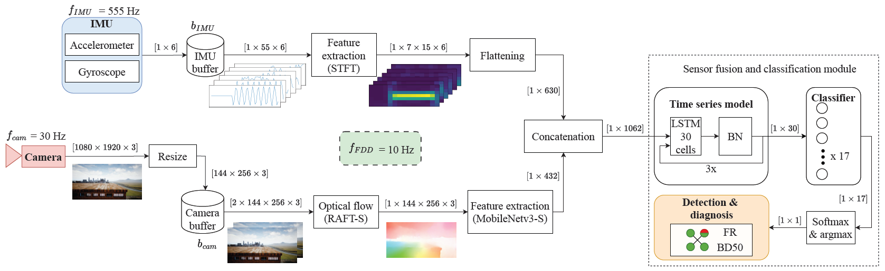

# Fault Detection and Diagnosis (FDD)


This work provides the implementation of the Fault Detection and Diagnosis Model proposed in the paper: "From Data to 
Prediction: Vision-Based UAV Fault Detection and Diagnosis". This entails the pre-processing of the camera and IMU
information, the sensor fusion model, tools for the visualization of the results.

The repository contains Python code for:
- the pre-processing of camera and IMU information, as well as the fusion of the features extracted from those 
different sensors.
- the generation of the confusion matrix to discern between the general, detection and diagnosis accuracies.
- tools for generating the visualizations used in the paper that ease the understanding of the architecture.

## Motivation
Fault Detection and Diagnosis (FDD) expands the envelope of the UAV’s self-awareness and allows informed decisions when
 deploying emergency
systems, such as a parachute, and switching between controllers or internal physics models to counteract a failure. 
Unfortunately, FDD approaches have been limited to the manipulation of signals from the
Inertial Measurement Unit (IMU), namely the accelerometers and gyroscopes, or additional external sensors such as
microphones or [optical flow sensors](https://www.researchgate.net/publication/327796861_Fault-Tolerant_Optical_Flow_SensorSINS_Integrated_Navigation_Scheme_for_MAV_in_a_GPS-Denied_Environment), 
which add weight and complexity to the system. Cameras are nowadays
ubiquitous in commercial UAVs and they have been ignored for this task, even though their information is already being
processed for navigation, such as [Simultaneous Localisation and Mapping (SLAM)](https://ieeexplore.ieee.org/document/7781977)
, and state estimation in GPS
denied urban regions, such as [Visual Inertial Odometry](https://arxiv.org/abs/1906.03289)
. Visual information is very rich and it could potentially
identify multiple failure types at once, as well as increase the accuracy when fused with the IMU sensor.

Machine learning methods are exploited in modern fault detection systems because they do not require a lot of
computations, allowing their use online in real-time. Here, an LSTM-based online FDD framework that fuses camera and 
IMU data is proposed.
To this end, the camera information is pre-processed by the [Raft](https://pytorch.org/vision/main/models/raft.html) 
optical flow model in order to extract the magnitude
and direction of the vehicle’s ego-motion. The IMU data is passed through a Short-Time Fourier Transform for
feature extraction. To the authors’ knowledge, it is the first time that both sensor sources are combined for UAV FDD.

The potential of the FDD has been demonstrated for the Parrot Bebop® 2 UAV in simulation. The FDD framework
was run at 10 Hz and it had to distinguish between 17 states: 16 failure states, namely four levels of blade damage failure
for each of the four propellers, and a healthy state.


## Code structure
The project contains the following files:

* *main.py*: Provides the code for testing the main capabilities of the FDD model and the generation of figures. After 
having provided all the inputs in the *user_input.py* file and selected the right mode in the same file, the *main.py* 
file can either train the model, plot the confusion matrix of the results or generate some visualizations included 
in the paper. The *main.py* relies on other files to provide that functionality.
 
* *user_input.py*: Provides all the inputs that the user can modify in a centralised file. In this file, the user can
choose the mode that will be used in the *main.py* file.

* *FlightDataGenerator.py*: Provides the Python generator that can be used as data source for the sensor fusion machine
learning model. It is an input pipeline that allows the extraction and pre-processing of data as required by the model
instead of pre-processing the complete dataset before training. The FlightDataGenerator object, apart from retrieving
the data from the file system, it pre-processes the data. The sensor data (e.g. IMU) is pre-processed by applying
a Short-Time Fourier Transform (STFT), whereas the camera data is pre-processed by extracting first its dense optical
flow (OF) and then compressing it using a feature extractor; in this case, the backbone of MobileNet. Additionally,
FlightDataGenerator contains the methods that allows the user to visualize the STFT and the OF of a single data point.

* *LstmFusionModel.py*: Provides the LstmFusionModel model, which fuses the camera and the sensor information with an
LSTM.

* *DeepNeuralFusionModel.py*: Provides the DeepNeuralFusionModel model, which fuses the camera and the sensor 
information with a simple Deep NN.

* *RaftBackboneTorch.py*: Provides the Raft model for the computation of optical flow from the images. It contains all 
the methods required for model instantiation, image pre-processing and inference.

* *helper_func.py*: It contains the help functions that support the data pre-processing, as well as the training,
validation and testing of the FDD architecture.

* *plotter_helper.py*: Functional code to generate the plots for the results of the FDD framework. It plots the confusion
matrix of the results, a figure with the predictions and their labels for a visual understanding of accuracy, and a 
plot that shows a histogram of the duration of the flights in the dataset for a better understanding of the composition of
the synthetic data used.

* *create_video.py*: Provides a function that creates a video given the images of a flight. The generated videos 
can be used for presentations.

* *checkpoints*: Folder that contains the model checkpoints used to obtain the results reported in the paper. 
There are 4 checkpoints, one for each of the results found in Table 4 of the paper.

To start using the code you can download the required Python libraries stored within _requirements.txt_. For that purpose,
it is as simple as running the following command within the command line:
```shell script
pip install -r requirements.txt
```
Then adjust the parameters that you deem necessary in _user\_input.py_ and run _main.py_.

You can also run it within Google Colab. For that you only copy-paste two lines. First:
```shell script
!git clone https://github.com/joigalcar3/FDD
```
This will clone the repository. Then you can open the _user\_input.py_ file and alter the user input. Second, run:
```shell script
!python FDD/main.py
```

## Implementation, results and conclusions
The results of this work can be found in the author's Master thesis and paper:

1. Master thesis: "From Data to Prediction: Vision-Based UAV Fault Detection and Diagnosis". Chapter 10
2. Paper: "Unreal Success: Vision-Based UAV Fault Detection and Diagnosis Framework". Section IV., Section V.B. and 
Section VI. 

These documents explain:
* Camera pre-processing
* IMU pre-processing
* Sensor fusion and classification module of FDD architecture
* Results
* Conclusions and recommendations

## Contact
Hope you enjoy the code!! For any questions, comments or suggestions, 
please reach out to me at [jialvear@hotmail.com](jialvear@hotmail.com).


    @inproceedings{dealvear2024BET,
      title={Unreal Success: Vision-Based UAV Fault Detection and Diagnosis Framework},
      author={de Alvear Cárdenas, J.I. and de Visser, C.},
      booktitle={AIAA Scitech 2024 Forum},
      year={2024}
    }